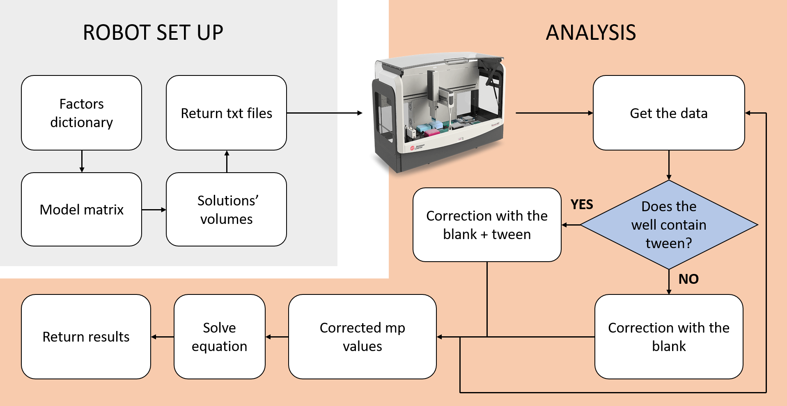

# High throughtput buffer screening on an automated workstation: Python pipeline for the automated robot set up and analysis

## Autors: Alexandre Thurmann, Blandine Vergier and Juliane Weller

The aim of our study was to find the optimum conditions to solubilize a fluorescent peptide. Therefore, we performed a buffer screening on an automated workstation. 

# Experimental design

For the buffer screening, we selected 7 different factors of 3 levels and 1 factor of 2 levels, following Taguchi Design (Unal and Dean, 1991). The measured response was the fluorescence intensity and/or the fluorescence polarization. The aim was to solve the following equation through matrix operation:

Y = a0 + a1 x factor1 + a2 x factor2 + a3 x factor3 + a4 x factor4 + a5 x factor5 + a6 x factor6 + a7 x factor7 + a8 x factor8 + a9 x factor1² + a10 x factor2² + a11 x factor3² + a12 x factor4² + a13 x factor5² + a14 x factor6é + a15 x factor7²

# Python 3 pipeline

For the robot set up, the program returns all the text files which contained the information regarding the volumes each solution to pipet and their destination in the plate. These text files can be directly read by the software of the robot. 

For the analysis part, the program takes as an input the values of fluorescence intensity and solve the matrix equation after correction of the data with the blank and calculation of mP values.

*Figure 1. Flowchart of the Python 3 pipeline for the robot set up and the data analysis.*

**Scripts:**
- *"buffer_screen_txt_create.py"* : Robot set up
- *"HD_project_buffer_screening_analysis.py"* :Buffer screenin analysis

# References

Unal, R. & Dean, E. B. TAGUCHI APPROACH TO DESIGN OPTIMIZATION FOR QUALITY AND COST: AN OVERVIEW. in 10 (1991).

